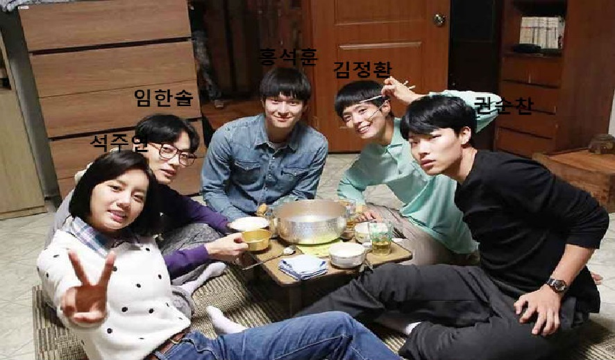
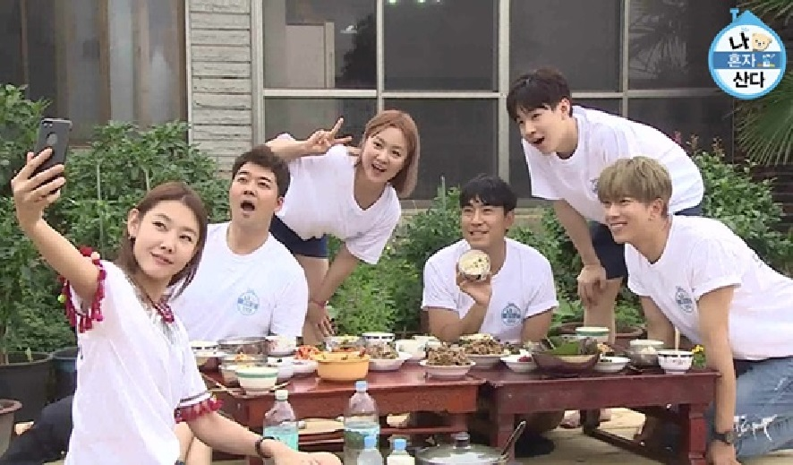

---?image=Image/BG.jpg
#  @color[white](사피미안 랩소디) 
@color[white](구미_2반_3조) 

---?image=Image/BG.jpg
@snap[north-west span-35]
@box[bg-green text-white demo-box-pad](홍석훈#별명 : 홍석 성격 : 솔선수범)
@snapend

@snap[north-east span-35]
@box[bg-pink text-white rounded demo-box-pad](김정환#별명 : 와리 성격 : 하나에 빠지면 집중)
@snapend

@snap[south-east span-35]
@box[bg-gray text-white demo-box-pad](임한솔#별명 : 솔이 성격 : 말이 많다)
@snapend

@snap[south-west span-35]
@box[bg-blue text-white waved demo-box-pad](석주연#별명 : 석이 성격 : 말보다 행동)
@snapend

@snap[midpoint span-35]
@box[bg-orange text-white waved demo-box-pad](권순찬#별명 : 차 성격 : 과묵)
@snapend

---?image=Image/BG.jpg
@snap[north-west text-white]
@size[1.5em](응답하라 사피미안)
@snapend

---?image=Image/BG.jpg
@snap[north-west text-white]
@size[1.5em](연말계획)
@snapend

---?image=Image/BG.jpg
@snap[north-west text-white]
@size[1.5em](연말계획)
@snapend

---?image=Image/BG.jpg
#  @color[white](감사합니다) 
